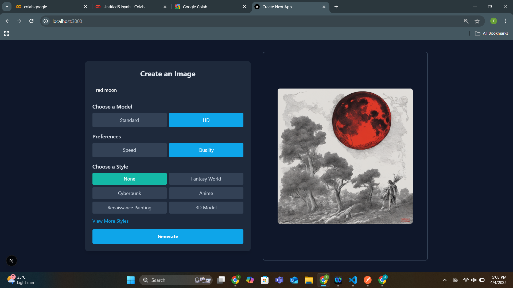

# 🖼️ AI Image Generator - SDXL + Next.js + Flask

This is a full-stack AI-powered image generator using **Stable Diffusion XL** on the backend (Flask) and a responsive UI built with **Next.js** and **Tailwind CSS** on the frontend.

## ✨ Features

- Generate AI images using `stable-diffusion-xl-base-1.0` and `refiner-1.0`
- Supports **standard** and **high-definition (HD)** generation modes
- Built-in image **download** button
- Clean UI with prompt input and preview section
- Runs on **GPU** if available
- Exposed to the web using `ngrok`

---

## 📸 Screenshots

### 🧠 Prompt Input and Generate Button




> Make sure to create the `assets/screenshots/` folder and place the screenshots there.

---

## 🛠️ Tech Stack

**Frontend**:  
- [Next.js](https://nextjs.org/)  
- Tailwind CSS  
- Fetch API for HTTP requests

**Backend**:  
- Flask  
- diffusers (Stable Diffusion XL)
- torch (with CUDA/GPU support)
- pyngrok

---

## 🚀 How to Run the Project

### 1. Clone the repository

```bash
git clone https://github.com/your-username/ai-image-generator.git
cd ai-image-generator
